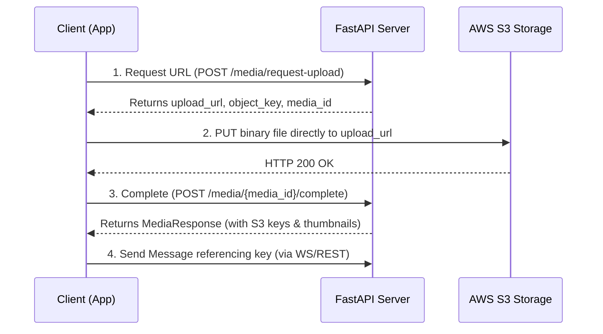
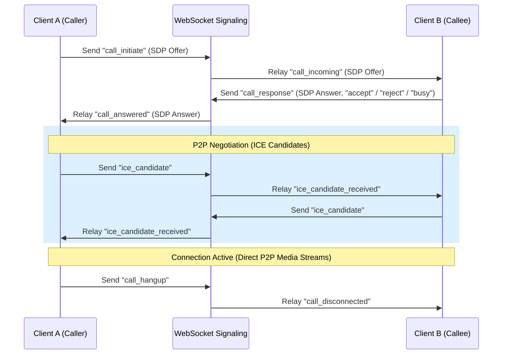

# 🚀 SChat Backend Integration & Architecture Guide

Welcome to the backend developer's integration guide for the **SChat** Flutter client application. This document outlines the application architecture, directory structures, state management patterns, API interaction details, and socket connection contracts to align the frontend client with the backend services.

---

## 🏗️ 1. Core Architecture Pattern

The SChat client is built using a structured **Clean Architecture** approach combined with the **BLoC (Business Logic Component)** pattern for state management. This ensures that UI logic, business use-cases, and data sources are decoupled.

### Directory Structure & Layers

The code resides inside the `lib/` directory, structured into logical feature modules:

* **`lib/core/`**: Shared services (e.g., local storage, dependency injection via `injectable`/`get_it`, API client configuration).
* **`lib/features/`**: Feature-specific sub-folders (e.g., `auth_screen`, `chat_screen`, `chat_socket_screen`, `call_screen`, `profile_screen`).
  * **`src/domain/`**: Pure Dart contracts, business models, and repository interfaces.
  * **`src/data/`**: Data sources (API requests, database persistence) and repository implementations.
  * **`src/presentation/`**: UI Views, Pages, Widgets, and BLoC managers (`bloc/`).
* **`lib/utils/`**: Helper files (e.g., design system tokens, fonts, endpoint maps).

---

## 💾 2. Local Storage & Client State Cache

The app relies on two local caching layers:
1. **SharedPreferences** (`StorageService`): Stores vital credentials, tokens, and device identifiers:
   * `access_token` / `refresh_token` (JWT tokens)
   * `user_id` & `username` & `email`
   * `profile_pic_url`
   * `device_id` (generated UUID for registration)
   * `has_synced_contacts` / `has_seen_permissions`
2. **Hive DB**: A lightweight key-value database for offline caching:
   * `cached_messages`: Local offline message cache.
   * `blocked_users_box`: List of blocked user records.
   * `muted_chats_box`: List of muted conversation IDs.
   * `contacts_box`: User phonebook numbers synced with the backend.
   * `chat_backgrounds`: Custom chat wallpaper preferences.

---

## 🔐 3. Authentication & API Interception Flow

The app secures all REST endpoints using JWT tokens.

```
[Flutter App] ──(Send OTP)──> /api/v1/auth/send-otp ──> [OTP SMS]
      │
[Enter OTP] ──(Verify OTP)─> /api/v1/auth/verify-otp ─> [JWT response]
      │
      └─> Saved in SharedPreferences (StorageService)
      │
      └─> Appends 'Authorization: Bearer <Token>' header to HTTP/WebSocket requests
```

* **HTTP Client**: Uses **Dio** with `ApiInterceptor` (`lib/core/network/api_interceptor.dart`) to append `Authorization: Bearer <JWT_ACCESS_TOKEN>` to outbound HTTP requests.
* **WebSocket client**: Passes the access token as a query parameter during handshake: `ws://<HOST>/ws?token=<JWT_ACCESS_TOKEN>`.

---

## 🔗 4. API Endpoints Map

Defined in `lib/utils/common_endpoints.dart`, the following endpoints are integrated:

### 🔑 Authentication
* `POST` `/auth/send-otp`: Sends mobile verification code.
* `POST` `/auth/verify-otp`: Confirms OTP; returns JWT access/refresh token pair.

### 👤 User Profile & Contacts
* `GET`/`PATCH` `/users/me`: Reads/updates authenticated user's profile details.
* `POST` `/users/sync-contacts`: Synchronizes local phonebook numbers.
* `GET` `/users/lookup`: Looks up users by phone.
* `GET`/`POST`/`DELETE` `/users/block/{userId}`: Block/unblock/list blocked users.
* `DELETE` `/users/me`: Deletes account.

### 💳 Subscriptions
* `GET` `/subscriptions/plans`: Returns subscription tier options.
* `POST` `/subscriptions/`: Enrolls user in a subscription plan.

### 💬 Conversation & Group Management
* `GET` `/chats/`: Lists current active chat channels.
* `POST` `/groups/`: Creates group channels.
* `GET`/`PATCH`/`DELETE` `/groups/{groupId}`: Read/Update/Delete group channels.
* `POST` `/groups/{groupId}/members`: Adds participants.
* `DELETE` `/groups/{groupId}/members/{userId}`: Removes participants.
* `POST`/`DELETE` `/groups/{groupId}/admins/{userId}`: Promote/Demote administrators.
* `POST`/`DELETE` `/chats/{conversationId}/favorite`: Toggle conversation star status.
* `POST`/`DELETE` `/chats/{conversationId}/mute`: Toggle notification mute.
* `POST` `/chats/{conversationId}/disappearing-timer`: Sets message automatic deletion timer.
* `GET`/`DELETE`/`POST` `/chats/{conversationId}/hide` or `/unhide`: Controls chat list visibility.
* `POST` `/chats/{conversationId}/clear`: Wipes conversation history.
* `PATCH` `/chats/{conversationId}/theme`: Updates chat workspace color configuration.

### ✉️ Message Controls
* `POST` `/messages/{messageId}/forward`: Forwards a message to another channel.
* `POST`/`DELETE` `/messages/{messageId}/pin` or `/unpin`: Pin/unpin a message.
* `GET` `/messages/{conversationId}/pinned`: Retrieve pinned messages.
* `PATCH` `/messages/{messageId}`: Edit text content or security permissions.
* `DELETE` `/messages/{messageId}`: Soft-delete/Delete for Everyone.
* `GET` `/messages/{messageId}/shares`: Audit message access metrics.

### 🔔 Push Notifications
* `POST` `/notifications/register-device`: Registers FCM push token mapped to `device_id`.

---

## 📤 5. Media Upload Workflow (S3 Presigned URLs)

Media attachments are not sent directly as binary frames over WebSockets. They follow a **4-step presigned URL cycle**:



### Supported Media Types
* `CHAT_IMAGE`
* `CHAT_VIDEO`
* `VOICE_NOTE`
* `DOCUMENT`

---

## 🔄 6. WebSocket Messaging Gateway

* **URL**: `ws://<HOST>/ws?token=<JWT_ACCESS_TOKEN>`
* **Data Protocol**: JSON-encoded string frames.
* **Handshake Guard**: If user lacks an active subscription, connection drops with **Code 1008 (Policy Violation)**.

### Outbound Events (Client ➔ Server) - CamelCase
* `"type": "send_message"`: Publishes text/attachments.
* `"type": "typing"`: Updates user typing status (`isTyping: true/false`).
* `"type": "read_receipt"`: Marks message list as read.
* `"type": "delete_message"`: Requests message deletion for everyone.
* `"type": "update_attachment_permissions"`: Modifies security attributes on media.

### Inbound Events (Server ➔ Client) - SnakeCase / CamelCase
* `"type": "new_message"`: Notifies clients of new incoming message.
* `"type": "typing"`: Relays target user typing status.
* `"type": "read_receipt"`: Relays read status.
* `"type": "message_deleted"`: Relays deletions.

### Media Bubble Permissions & Privacy
Messages contain nested safety parameters:
* `security`: Maps `isLocked` (hides content for unauthorized users), `accessUsers` (whitelisted viewing IDs), `allowDownload`, and `allowShare` flags.
* `viewControl`: Enables view-once constraints (`"type": "once"`), redacting files once `maxViews` is exceeded.

---

## 📞 7. WebRTC Calling Signaling Protocol

Calls use WebRTC for peer-to-peer audio/video. The WebSocket connection serves as the signaling server to route SDP negotiation configurations.



### Signal Codes Table

| Sent Type (`type`) | Relayed Inbound Type | Description |
| :--- | :--- | :--- |
| `call_initiate` | `call_incoming` | Transmits SDP Offer to callee. |
| `call_response` | `call_answered` / `call_rejected` | Delivers Callee's SDP Answer or Reject action. |
| `ice_candidate` | `ice_candidate_received` | Standard WebRTC ICE candidates exchange. |
| `call_hangup` | `call_disconnected` | Ends active call or cancels dialing. |

---

*This guide ensures the backend and client stay synchronized on naming standards (camelCase payloads, snake_case signals, HTTP endpoints) and structural contracts.*
